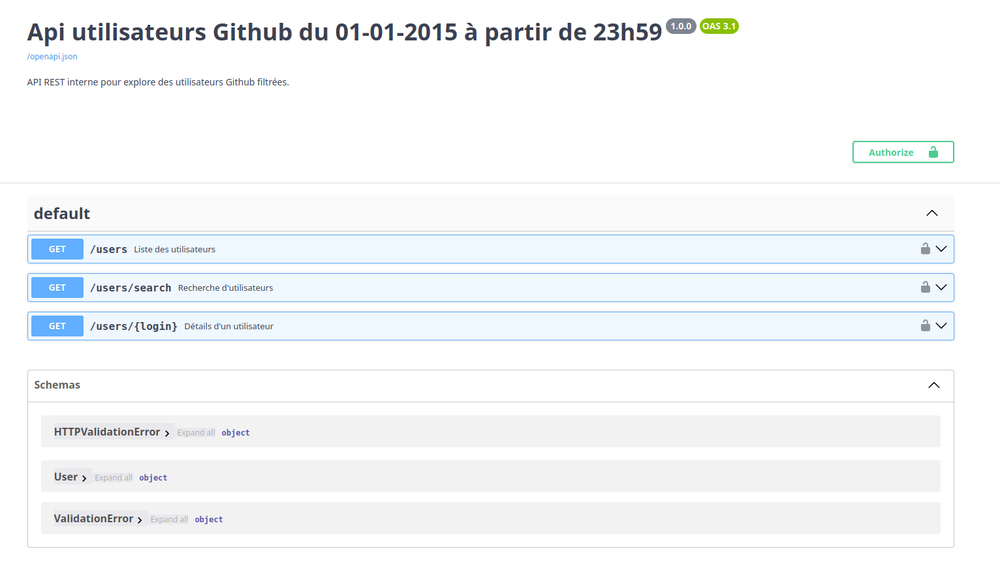
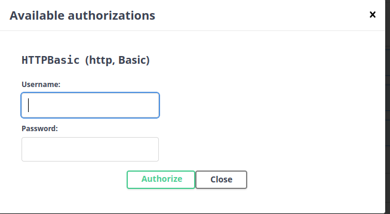
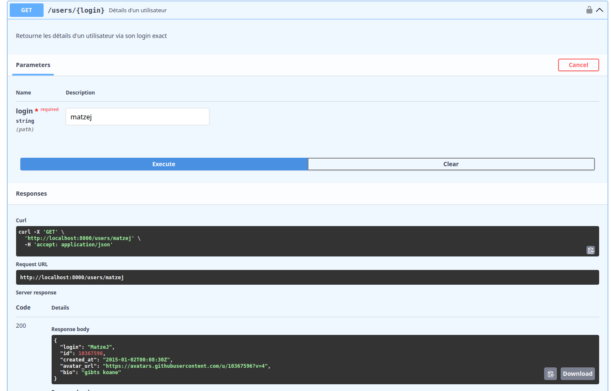
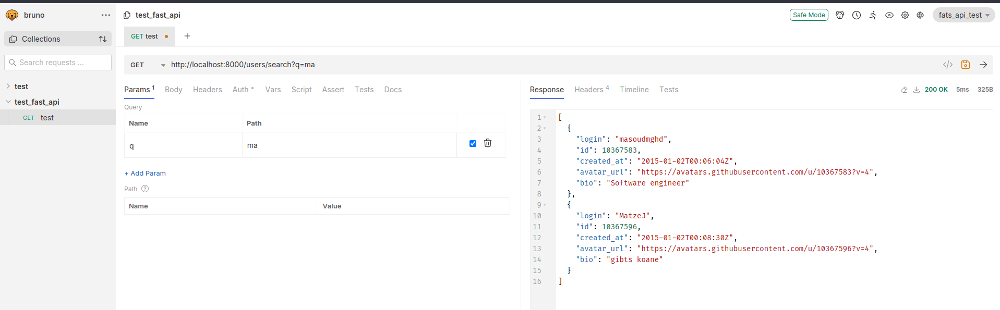

# 

  

# **🚀 TP FastAPI – API REST Utilisateurs GitHub**

> Extraction, filtrage et exposition d'utilisateurs GitHub via une API sécurisée **FastAPI**

Ce projet a pour objectif de créer une API REST sécurisée permettant d'exposer des utilisateurs GitHub filtrés à partir du 01/01/2015 à 23h59. Il inclut les étapes d’extraction, de nettoyage, et d’exposition via FastAPI, avec authentification HTTP Basic.

* * *

## 📁 Structure du projet

```bash
gitapi_fastapi/
├── api
│   ├── main.py
│   ├── models.py
│   ├── routes.py
│   └── security.py
├── data
│   ├── filtered_users.json
│   └── users.json
├── .env
├── .env.example
├── extract_users.py
├── filtered_users.py
├── .gitignore
├── images_readme
│   ├── exemple_bruno.png
│   ├── exemple_swagger.png
│   ├── gitapi.png
│   ├── swagger_autorisation.png
│   └── swagger_presentation.png
├── LICENSE
├── README.md
├── requirements.txt
└── tests
    ├── test_routes.py
    └── test_security.py
```

* * *

## 🔧 Installation & configuration

1.  **Cloner le projet :**
    
    ```bash
    git clone https://github.com/benjsant/gitapi_fastapi.git
    cd gitapi_fastapi
    ```
    
2.  **Créer un environnement virtuel** *(optionnel mais recommandé et avec python 3.10)* :
    
    ```bash
    python -m venv .venv
    source .venv/bin/activate  # sous Linux/macOS
    .venv\Scripts\activate     # sous Windows
    ```
    
3.  **Installer les dépendances** :
    
    ```bash
    pip install -r requirements.txt
    ```
    
4.  **Configurer les identifiants d'authentification** :
    
    Copiez le fichier `.env.example` vers `.env` :
    
    ```bash
    cp .env.example .env
    ```
    
    Puis modifiez-le avec vos identifiants (pour créer un token Github, [je vous invite à aller sur le lien pour en générer un juste ici](https://github.com/settings/tokens) ):
    
    ```python
    #token gihtub pour récupérer des données de l'API Github
    GITHUB_TOKEN=ghp_votre_token
    
    #Identifiant de test
    USERNAME=admin
    PASSWORD=admin123
    ```
    

* * *

## 🛠️ Scripts

Exécutez les scripts suivants dans l’ordre ci-dessous, après avoir configuré votre fichier `.env`

### Extraction des utilisateurs depuis GitHub

> 🔐 Nécessite un token GitHub personnel dans les headers (et placez dans le.env comme annoncé précédemment)

```bash
python extract_users.py
```

### Filtrage des utilisateurs extraits

```bash
python filtered_users.py
```

Le fichier `filtered_users.json` sera généré dans le dossier `data/`.

* * *

## 🌐 Lancer l'API

Lancer le serveur FastAPI :

```bash
uvicorn api.main:app --reload
```

API disponible sur : http://localhost:8000  
Documentation Swagger : http://localhost:8000/docs

Voici un aperçu général de Swagger:



* * *

## 🔐 Authentification

Toutes les routes nécessitent une **authentification HTTP Basic**.

Exemple de requête :

```bash
curl -u admin:admin123 http://localhost:8000/users
```

> Swagger permet aussi de tester l’authentification : cliquez sur Authorize, entrez ```admin / admin123```, puis validez.



* * *

## 📡 Endpoints disponibles

Ici je vais vous montrer comment récupérer des valeurs à l'aides des différentes URL, je précise que vous pouvez récupérer les données de plusieurs manières:

1.  Par **curl** en ligne de commande
2.  Avec l'outil **[Postman](https://www.postman.com/downloads/)** ou **[Bruno](https://www.usebruno.com/)**
3.  Avec l'interface **Swagger** dans http://localhost:8000/docs avec l'option "**Try it out**" de la requête

> ⚠️ Si vous êtes sur Windows, il vaut mieux que vous utilisez le **GitBash** pour les commandes curl ou utilisez spécifiquement **curl.exe** dans votre powershell.

> Je précise également que le **GitBash** est installé par défaut lorque vous installez git. 

exemple powershell avec **curl.exe**:
```powershell
curl.exe -u admin:admin123 "http://localhost:8000/users"
```

### 🔍 GET /users

Retourne la liste complète des utilisateurs filtrés.

```bash
curl -u admin:admin123 "http://localhost:8000/users"
```

**Exemple de réponse :**

```JSON
[
  {
    "login": "dalesimpson",
    "id": 10367558,
    "created_at": "2015-01-01T23:59:36Z",
    "avatar_url": "https://avatars.githubusercontent.com/u/10367558?v=4",
    "bio": "I help organizations become digital first by building digital product delivery teams that create high-quality customer experiences at scale. "
  },
  {
    "login": "olivaresleonard",
    "id": 10367559,
    "created_at": "2015-01-01T23:59:41Z",
    "avatar_url": "https://avatars.githubusercontent.com/u/10367559?v=4",
    "bio": "Desarrollador FullStack"
  },
  {
    "login": "masoudmghd",
    "id": 10367583,
    "created_at": "2015-01-02T00:06:04Z",
    "avatar_url": "https://avatars.githubusercontent.com/u/10367583?v=4",
    "bio": "Software engineer"
  },
  {
    "login": "MatzeJ",
    "id": 10367596,
    "created_at": "2015-01-02T00:08:30Z",
    "avatar_url": "https://avatars.githubusercontent.com/u/10367596?v=4",
    "bio": "gibts koane"
  },
  ...
]
```

### 🔍 GET /users/{login}

Retourne les détails d’un utilisateur par son `login`.

```bash
curl -u admin:admin123 "http://localhost:8000/users/MatzeJ"
```

### Exemple avec Swagger:



### Exemple de réponse:

```JSON
{
  "login": "MatzeJ",
  "id": 10367596,
  "created_at": "2015-01-02T00:08:30Z",
  "avatar_url": "https://avatars.githubusercontent.com/u/10367596?v=4",
  "bio": "gibts koane"
}
```

### 🔎 GET /users/search?q={mot-clé}

Recherche des utilisateurs dont le `login` contient le mot-clé.

```bash
curl -u admin:admin123 "http://localhost:8000/users/search?q=ma"
```

**Exemple de réponse avec Bruno:**



### Exemple de réponse:

```JSON
[
  {
    "login": "masoudmghd",
    "id": 10367583,
    "created_at": "2015-01-02T00:06:04Z",
    "avatar_url": "https://avatars.githubusercontent.com/u/10367583?v=4",
    "bio": "Software engineer"
  },
  {
    "login": "MatzeJ",
    "id": 10367596,
    "created_at": "2015-01-02T00:08:30Z",
    "avatar_url": "https://avatars.githubusercontent.com/u/10367596?v=4",
    "bio": "gibts koane"
  }
]
```

* * *

## 🧪 Tests

&nbsp;J'ai ajouté des tests dans le dossier `tests/`, ils peuvent être exécutés avec :

```bash
pytest -v
```

Les tests couvrent :

- `test_routes.py` : vérifie les réponses des endpoints (code 200/401/404, contenu JSON, etc.)
    
- `test_security.py` : teste la logique d’authentification (valide/invalide)
    

## 📦 Dépendances principales
> Ces dépendances seront automatiquement installées via ```pip install -r requirements.txt```.
- `fastapi`
    
- `uvicorn`
    
- `requests`
    
- `python-dotenv`
    
- `pytest`
    
- `httpx`

* * *

## 📜 Licence

Ce projet est fourni sous licence MIT. Voir le fichier LICENSE.
